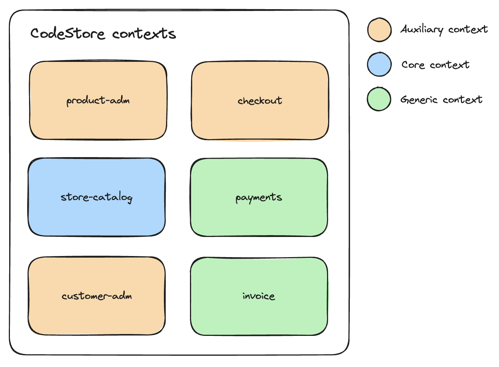

# Monolithic Systems

Monolithic Systems are systems that are built as a single unit. In other words, if you are changing one part of the system and you have to build and deploy the entire system again, you are dealing with a monolithic system. It is a single deployable unit.

Additionally, there are several controversies about monolithic systems, like that they are outdated, hard to maitain, and hard to scale. However, monolithic systems are still widely used and are a good choice for many applications. It is just a matter of taking the right decisions when building your system.

## When using a monolit might be a good idea?

- When working on a new project where the business requirements are not clear yet;
- When the core business logic is not well defined and unstable;
- When you want to avoid complexity related to deploying and managing multiple services;
- When you have a small team and you want to avoid operational overhead;

## Types of monolithic systems

In Monolith to Microservices by Sam Newman, the author describes three types of monoliths:

- **Single-process monolith:** This is a system where all components are part of a single codebase and run in a single process. It's a self-contained application with tightly coupled components. If any component needs to be updated, the entire application typically needs to be redeployed, making it challenging to scale or manage.

- **Distributed monolith:** While this architecture may seem distributed across different services or systems, it still functions as a monolith because of the tight coupling between components. These services are interdependent, so changes in one service require synchronized updates across others. Despite appearing to be a microservices approach, the lack of true decoupling makes it behave as a monolith.

- **Black-box monolith:** This is an opaque system where the internal workings are unclear or not easily modified. It is difficult to understand or refactor because the codebase is poorly structured or poorly documented. The lack of visibility makes it hard to break this monolith into microservices since internal dependencies and logic are unclear.

The **Single-process monolith**, which is the one we will be focusing on, can be subdevided into three categories:

1. **Tightly coupled monolith:** A monolithic architecture where all components are highly interdependent, making changes might be difficult due to the strong coupling between them. Modifying one component often requires adjustments to many others.

2. **Modular monolith:** A monolithic system with loosely coupled components, allowing for easier changes and maintenance. Components are more independent, reducing the risk of ripple effects when modifying individual parts.

3. **Modular monolith with segregated databases:** A modular monolith where each component has its own database, enhancing component independence. However, this approach can lead to challenges in maintaining data consistency and may result in data duplication.

## Application contexts

Below you can find the contexts of the application that we will be building in this repository. It's important to mention that communication between contexts, even though they are in the same monolithic system, should always be done through a [Facade layer](https://refactoring.guru/design-patterns/facade), which will be responsible for enhancing the decoupling between the contexts. Additionally, for external communication, we will have an API Gateway layer, which will be responsible for routing the requests to the correct context.



## Running Locally

1. Install the dependencies:

```bash
npm install
```

2. Run the tests:

```bash
npm run test
```

3. Start the application:

```bash
docker-compose up -d
```
